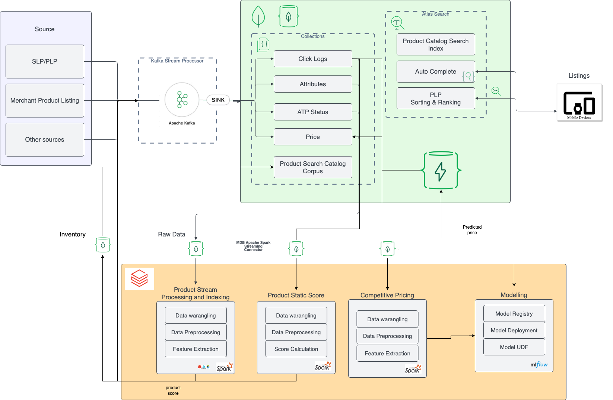

### Introduction
In a retail enviroment putting the customer first becomes key to success any ecommerce bussiness. So each and every interaction of the customer on a Web Application can inform about the customer prefrences and interests. Modeling around customers information help unlock value in aiding purchase decisions and there by moving the KPI of the bussiness.
In this repository we have demostrated the capabilities to store real time interaction of customer on the Web application to model the following behviours:
1. Competitive price suggestion using the purchase behaviour of the product
2. Bussiness intelligence score for individual products to determine the sellabilitiy of the product

These modeled features are then used to power the sorting and ranking functionalities on the discoverabiltiy front of these products.

### Architecture 


### Architecture Overview
The E commerce retail architecture for Competitive pricing and Search comprises of 4 main layers namely:
1. Multi-tenant streaming ingestion
2. Stream processing
3. AI/ML modeling
4. Operational Data Store and Search Engine

A modern e-commerce backed system should be able to collate data from multiple sources in real-time as well as batch loads and be able to transform this data into a schema/format upon which a Lucene search index can be built to enable discovery of the added inventory. Also the architecture should also be able to integrate customer behavior on the website positively contributes towards discoverability of inventory and at the same time supports and improves purchase decisions with a good profit margin.

These features are nice captured in the above e-commerce architecture where:
1.With the help of MongoDB Kafka connector we are able to sink real time data from multiple sources to mongodb.
2.With the help of MongoDB Spark connector and Databricks MLflow we are able to prepare features and train a robust ML model to predict the price of the inventory given the near real-time clickstream data on the given products.
3.All the generated streams of data are transformed and written into a unified view in MongoDB collection called catalog which is used to build search indexes and support querying and discovery of products.
4.With the help of Atlas Search capabilities and robust aggregation pipelines we can power features such as search/discoverability, hyper personalization and featured sort on Mobile/Web applications.


## Prerequisites
Before running the app, you'll need to have the following installed on your system:
- Python 3
- pip3
- npm

## Deploy the Backend Service
- Clone this repository to your local machine.
    ```bash
    git clone https://github.com/ashwin-gangadhar-mdb/retail-pricing-search-personaliztion.git
    cd mobile-demo/backend-service
    ```

- Update the MongoDB Connection String in the following file.
    - `./service/app.py`

- Install the project dependencies using pip
    ```
    pip3 install -r [label](service/requirements.txt)
    ```
- Run the Python code.
    ```
    python3 app.py
    ```

## Running the App
- Start Kafka Client
- Update the kafka sink connector config in
    - ./kafka/mongodb-clogs-sink-connector.properties 
    - ./kafka/mongodb-atp-sink-connector.properties
- Run the connectors for kakfa
    ```bash
    ./run-connector.sh ./kafka/mongodb-clogs-sink-connector.properties ./kafka/mongodb-atp-sink-connector.properties
    ```
- Clone this repository to your local machine.
    ```bash
    git clone https://github.com/ashwin-gangadhar-mdb/retail-pricing-search-personaliztion.git
    ```
- Install the dependencies using npm or Yarn.
    ```bash
    cd frontend
    npm install react-scripts@latest
    ```
- Update the API credentials and Endpoints in the following location
    - `frontend/src/config.js`
- Start the React App in a separate terminal window.
```bash
npm start
```
